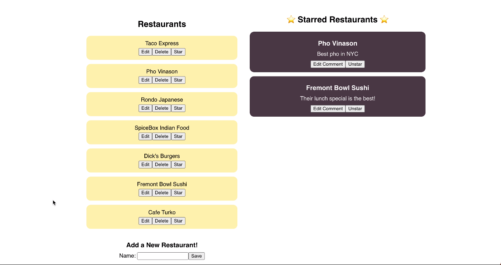

### PURPOSE
This site will allow its users to:
1. view a list of saved restaurants
2. add to that list
3.  star their favorite restaurants
4.  Leave comments about these places.

### Screenshot

## Available Scripts

In the project directory, you can run:
### npm install

To run the application, you will need to have two separate terminal windows or tabs open: one for the frontend folder and the other for the backend folder. You will want to start the application in backend folder, then the frontend folder. You can start the application with the following command:

### npm run start

You will get a notification in the terminal window when starting the server in the frontend folder, stating that the port 3000 is in use and asking if you would like to use another port like below:

Would you like to run the app on another port instead? › (Y/n)

Type y in the terminal prompt to use a different port.
Runs the app in the development mode.\
Open [http://localhost:3000](http://localhost:3000) to view it in your browser.

The page will reload when you make changes.\
You may also see any lint errors in the console.

### `npm test`

Launches the test runner in the interactive watch mode.\

### `npm run build`

Builds the app for production to the `build` folder.\
It correctly bundles React in production mode and optimizes the build for the best performance.

The build is minified and the filenames include the hashes.\
Your app is ready to be deployed!

See the section about [deployment](https://facebook.github.io/create-react-app/docs/deployment) for more information.

### `npm run eject`

**Note: this is a one-way operation. Once you `eject`, you can't go back!**

If you aren't satisfied with the build tool and configuration choices, you can `eject` at any time. This command will remove the single build dependency from your project.

Instead, it will copy all the configuration files and the transitive dependencies (webpack, Babel, ESLint, etc) right into your project so you have full control over them. All of the commands except `eject` will still work, but they will point to the copied scripts so you can tweak them. At this point you're on your own.

You don't have to ever use `eject`. The curated feature set is suitable for small and middle deployments, and you shouldn't feel obligated to use this feature. However we understand that this tool wouldn't be useful if you couldn't customize it when you are ready for it.
## WHAT I LEARNT NEW
I used nodemon to run the back-end server. nodemon is a Node package that watches our files and automatically restarts the server each time we save a change. Without it, we’d need to restart the server each time we made a change to see those changes take effect.
